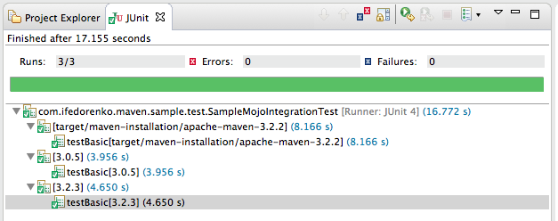

# Test Support

TEAM introduces improved support for testing your Maven plugins in the form of
a small, cohesive, one-stop library for developing unit and integration tests.
The library provides a superior alternative to maven-plugin-testing-harness
and maven-verifier and invoker based test setups.

The main features and benefits are:

1. Convenient junit4-based API

2. Flexible unit test mojo configuration API simplifies test project setup and maintenance

2. Support for locating main and test code in the same build module

3. No need to install or deploy plugins to run tests

4. Capability to easily run plugin integration tests against multiple Maven versions from one build invocation

5. Integration with takari-lifecycle and incrementalbuild library

6. Fully supported by the Maven Development Tools m2e extension

7. Full support for all maven versions starting with 3.0

## Plugin Unit Testing

### Configuring the POM

In order to write unit tests for your Maven plugin, you simply add the dependency to the takari-plugin-testing to your
POM.

````
<dependency>
  <groupId>io.takari.maven.plugins</groupId>
  <artifactId>takari-plugin-testing</artifactId>
  <version>2.8.0</version>
  <scope>test</scope>
</dependency>
````

In additon, the plugin testing requires dependencies to maven-core and maven-compat. Most likely, your plugin already
has these dependencies, but if they are missing you have to add them with test scope at a minium.

````
<!-- required if not already present in main dependencies -->
<dependency>
  <groupId>org.apache.maven</groupId>
  <artifactId>maven-core</artifactId>
  <version>${mavenVersion}</version>
  <scope>test</scope>
</dependency>
<dependency>
  <groupId>org.apache.maven</groupId>
  <artifactId>maven-compat</artifactId>
  <version>${mavenVersion}</version>
  <scope>test</scope>
</dependency>
````

To improve you build time and take advantage of the Takari lifecycle, you can optionally change your plugin to
use the takari-maven-plugin packaging.

````
<packaging>takari-maven-plugin</packaging>
````

### Writing a Test

With these modifications to your pom.xml completed, you are ready to write your first unit test.

````
public class PluginUnitTest {
  @Rule
  public final TestResources resources = new TestResources();

  @Rule
  public final TestMavenRuntime maven = new TestMavenRuntime();

  @Test
  public void test() throws Exception {
    File basedir = resources.getBasedir("testproject");
    maven.executeMojo(basedir, "mymojo", newParameter("name", "value");
    assertFilesPresent(basedir, "target/output.txt");
  }
}
````

## Plugin Integration Testing

TEAM plugin integration testing allows you to run integration tests for your
project that span a new Maven invocation to run a full Maven build of an example
Maven project. This can include multiple runs with different Maven versions, log
analysis and different test runs for the same projects. IDE support is available
and allows you full debugging of your build.

### Configuring the POM

A dependency to the integration testing needs to be added to the POM of the project
containing the integration tests. Note how the dependency uses a test scope as usual,
but also has the type set to pom.

````
<dependency>
  <groupId>io.takari.maven.plugins</groupId>
  <artifactId>takari-plugin-integration-testing</artifactId>
  <version>2.8.0</version>
  <type>pom</type>
  <scope>test</scope>
</dependency>
````

In addition you have to adopt the Takari lifecycle by using the packaging takari-maven-plugin
or alternatively by adding the plugin manually and adding the testProperties goal invocation:

````
<plugin>
  <groupId>io.takari.maven.plugins</groupId>
  <artifactId>takari-lifecycle-plugin</artifactId>
  <version>1.11.11</version>
  <executions>
    <execution>
      <id>testProperties</id>
      <phase>process-test-resources</phase>
      <goals>
        <goal>testProperties</goal>
      </goals>
    </execution>
  </executions>
</plugin>
````

This completes the necessary configuration in the POM.

### Adding Test Projects

The example projects used for the integration tests runs should be located in `src/test/projects`
and can be Maven projects of any type and complexity. The version of the actual
plugin being tested is passed into the test run as a property `it-plugin.version`
This property can used in your test project to set the plugin version:


```
<groupId>com.example.maven.plugins</groupId>
<artifactId>example-maven-plugin</artifactId>
<version>${it-plugin.version}</version>
```

### Writing a Test

An actual test with a minimal test building an project in `src/test/projects/example`
could look like the following:

````
@RunWith(MavenJUnitTestRunner.class)
@MavenVersions({"3.0.5", "3.3.3"})
public class ExampleTest {

  @Rule
  public final TestResources resources = new TestResources();

  public final MavenRuntime mavenRuntime;

  public ExampleIT(MavenRuntimeBuilder builder) throws Exception {
    this.mavenRuntime = builder.build();
  }

  @Test
  public void buildExample() throws Exception {
    File basedir = resources.getBasedir( "example" );
    MavenExecutionResult result = mavenRuntime
          .forProject(basedir)
          .execute( "clean", "install" );

    result.assertErrorFreeLog();
  }
````

The build will run a full build of the `example` project by copying it to the a
method and Maven specific folder in `target/test-projects` . The `MavenVersions`
annotation supports multiple versions to be specified and relies on the Maven
installation done by the POM configuration with the dependency plugin.
The MavenRuntime object allows you to set further parameters using withCliOption.

### Command Line Test Execution

The tests can be executed as normal junit tests run with the Surefire Maven
plugin. Alternatively you can use the Failsafe plugin to run them separate from
the unit tests.

To run a specific test on the command line you can use

```
mvn test -Dtest=ExampleTest
```

for a surefire test run or

```
mvn test -Dtest=ExampleTest
```

for a failsafe test run.

### Running a Test in Eclipse

When using the plugin testing on a project in Eclipse with M2e, the required
tooling including the Maven Development tools will be automatically installed.
This will enable to you to e.g., run a single test by right-clicking on the test
 method or class and selecting Run As/Debug As - Maven Junit Test.

The following figure shows a sample test with multiple invocations for different
Maven version after a successful run within Eclipse.



